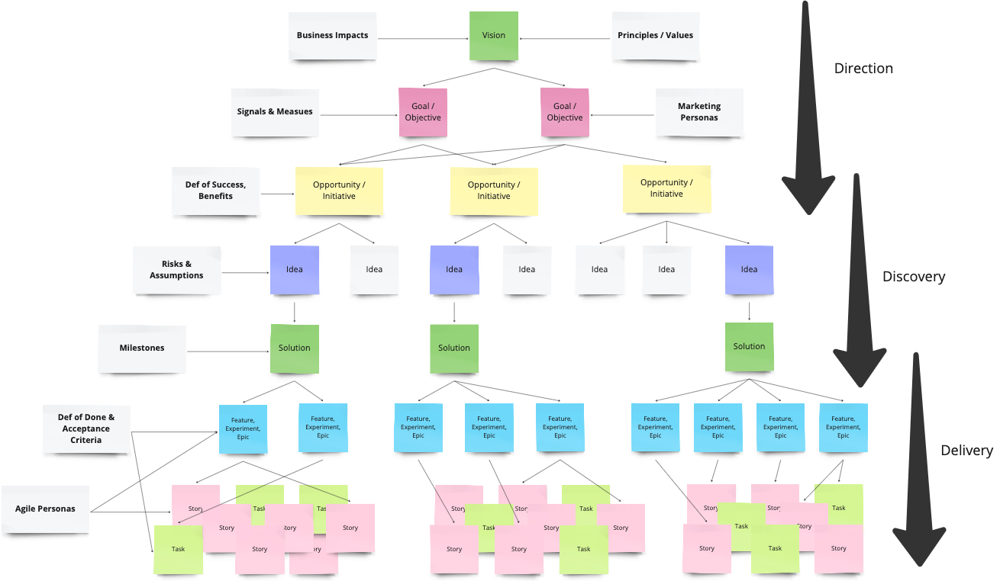

# Intro to Portfolio Management

## Principles

### Align to Strategy

Portfolio management is all about strategic alignment. Of course, you need a strategy to align to first!

Once you’ve got clarity on the organizational strategy, the portfolio team can make sure that each initiative has a clear link back to a strategic objective. After all, if the work doesn’t help drive the strategy forward, why are you doing it?

Knowing how each initiative links back to the strategic objectives means that you can better prioritize the work. You can also ensure that each area of the strategy is getting adequate attention.&#x20;

The principle of ensuring the company’s change portfolio is aligned with where you want the business to go is the first one you need to get right. Everything else can follow later, but if you aren’t working on the right initiative, you should fix that first!

### Shut Down Early

Not all projects are going to be successful. And that’s OK. Your business changes, the industry changes, and you want to change with it. Keeping your portfolio up-to-date and aligned with where you are going is important. Sometimes, projects will stop being relevant.

However, that’s where our strong PMO comes into play.

If a project is no longer considered relevant, it has to be stopped. Salvage what you can, but don’t continue to work on something so that you can say it was completed. If it’s going to deliver something that is irrelevant to the current strategy, what’s the point?

IT portfolio management is an area to pay particular attention to. As technologies move on so quickly, it’s possible that some projects that are in flight or in the pipeline are no longer aligned to the tech stack and should be changed or removed from the list of current work.

Use your portfolio management team to help senior managers understand the rationale for closing projects that will no longer deliver the expected benefits. Redirect the resources to projects where you can achieve something good.

### Deliver Value Continuously&#x20;

Every portfolio promises value, and therefore, engaging sponsors consistently and effectively becomes critical to assess whether that promise is being delivered or the portfolio is becoming irrelevant.&#x20;

For a dynamic digital business, it’s a good practice to have weekly meetings at which product managers and sponsors can discuss the previous week’s deliverables, ongoing tasks, resource availability, and existing risks or roadblocks.&#x20;

This way, the involved parties can keep track of the portfolio’s health and realign it with value, if required.

### Lead the Change

Projects sometimes flounder when senior leadership isn’t there. As an effective portfolio team, you can support project sponsors, encourage directors to take active roles and provide information to help leaders make the right choices.

The portfolio structure is the primary way of leading the business in the direction of achieving the strategy. The PMO and portfolio team are crucial in this – you can use the information you have to provide recommendations as well as simply report on facts.

The portfolio management leadership team should become trusted strategic advisors to the executive team. You can comment on what projects should be taken on next, areas where the business is not investing enough in change and more.

### Get Comfortable with Risk

A large portfolio of changes will come with some risks. Even a small portfolio will have risky projects. Part of the portfolio management approach is to balance the risk. If you have too many risky projects, that could prove problematic. Equally, not enough risk-taking might mean the company is stagnating and losing margin to more innovative competitors.

Getting the balance of risk right in a portfolio is a constant job. Projects are closed or completed. New projects start. Projects from the pipeline are reprioritized, and others jump to the top of the list. The list of things you are currently working on as a business can be extensive.

Part of the portfolio management role is to make sure that the mix of projects is appropriate for the business. There are some strategic-level conversations to be had to ensure that is the case, and you’ll need to work with the enterprise risk management team as well.

### Promote Transparency at All Levels

Finally, portfolio management needs to be done in a transparent way. That means the data you produce must be an honest representation of the truth. Regardless of how you present the facts, they are the facts.

The portfolio management team should be known for objectivity and factual reporting. You can provide narrative and context, but the performance of projects, programs, and the portfolio overall should never be open to interpretation.

This quest to present data in a transparent way is part of creating an open culture. Hopefully, by leading from the top, you can ensure this approach to honest reporting cascades down and out to project managers and others involved in reporting task progress.

Enterprise portfolio management – effective portfolio management – goes far beyond tracking project progress in PMO software tools and making sure project managers have done some training. You can be truly valuable to the organization in a portfolio management role, and portfolio management is truly valuable to the organization.

### Keep Things Simple and Streamlined

Portfolio managers understand that they have to keep their activities simple and streamlined. Remember that the goal is to focus on how to make the right decisions regarding the project and to guide project members. This means that keeping and reviewing extensive documentation is not a priority.

Plans aren’t chiselled in stone. In lean portfolio management, one must continuously review and adapt to the changing environment to maintain value and eliminate waste. Project roadmaps are valuable tools in this process as they help portfolio managers by giving them an overview in which they can strategically reallocate resources to maintain value while eliminating waste. Try our roadmap template to get started.

### Concentrate on Value Instead of Cost

A good portfolio manager asks about the value a project will generate instead of how much it will cost. Focusing on the former will help you think of how to make improvements in the company’s IT endeavours. After all, any development in this area can further your group’s capability to create value for clients.

### Minimize Cost of Delay (CoD)

One effective strategy for optimising stakeholder worth is to invest in generating functionality that will give the most value to the company in less time. For instance, if you delay for six months the creation of functionality that can create a $10 million yearly revenue, then you will end up with a Cost of Delay that’s worth $5 million. A good agile portfolio manager thinks about how much designing a solution costs, the Cost of Delay (CoD) from putting off developing said solution, and the cost savings or revenue when assessing the total value of a solution.

### Opt for Stable Teams&#x20;

Agile portfolio management is more about coordinating and overseeing various teams. Agile recognises that initiative doesn’t end when a project wraps up. Changes will be expected, and when it happens, the team will have to release another solution. Due to this, long-standing stable teams, with members that have grown and evolved over the course of several projects, have numerous advantages over teams that are only together for short-term projects. It’s clear that there’s a marked improvement in productivity when organisations bring the project to a stable team over just pulling people into a specific project.

### Allow for Diversity

Companies should understand and accept that every team and team member is unique. Every group meets a distinct situation that changes over time. This means that teams should be permitted to organise themselves and adapt their methods to meet each distinct situation. An agile framework focuses on supplying, as well as comparing and contrasting, numerous process options. This also means that portfolio managers should be flexible in how they approach each team and project. They should know how to adjust because even though each team handles projects differently, managers still have to guide them and monitor the effectiveness of every group.

## PMO Practice Model

<figure><figcaption></figcaption></figure>

In today’s changing world of work, mastering these seven competencies gives savvy PMOs the insights needed to thrive.

* Demand Practice&#x20;
  * Strategic Alignment&#x20;
  * Business- or Technology-driven Prioritisation&#x20;
  * Valuable Initiative Selection&#x20;
  * Leveling Workload (Mura)&#x20;
* Risk Practice&#x20;
  * Risk Identification and Mitigation&#x20;
  * Learn + Adjust&#x20;
  * Waste Removal (Muda)&#x20;
* Performance Practice&#x20;
  * Value/Benefits&#x20;
  * Cost of Delay & Metrics&#x20;
  * WIP Limits & Bottleneck Management&#x20;
  * Continuous Improvement (Kaizen)&#x20;
* Report Practice&#x20;
  * Data-driven Decisions&#x20;
  * Real-time Health&#x20;
  * Visibility & Transparency&#x20;
  * Retrospectives (Hansei)&#x20;
* Delivery Practice&#x20;
  * Incremental Delivery&#x20;
  * Planning & Scheduling&#x20;
  * Feedback loops&#x20;
  * Think Slow and Act Fast (Nemawashi)&#x20;
* Asset Practice&#x20;
  * \$$, Skills, People & Tools&#x20;
  * Flow to Stable Teams&#x20;
  * Capacity Planning&#x20;
  * Automation (Jidoka)&#x20;
* Change Practice&#x20;
  * Culture & Team Dynamics&#x20;
  * Communications&#x20;
  * Planning/Releases&#x20;
  * Governance (Genchi Genbutsu)

## Integration Into Flow&#x20;

<figure><figcaption></figcaption></figure>
